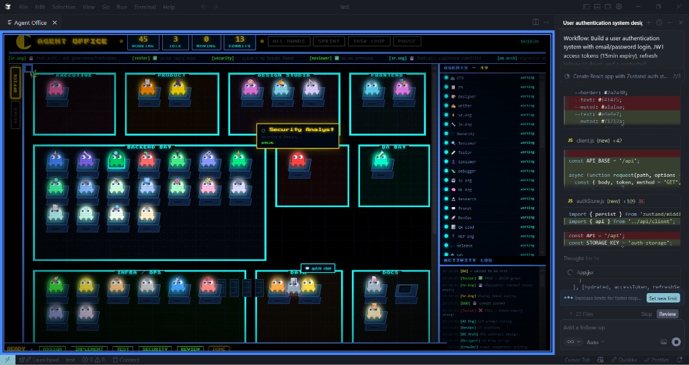

# Cursor Agent Workflow — Skill-Based Quality

**A skill and agent workflow for Cursor:** 48+ agent roles, 77+ skills, and a full workflow from idea to implementation—so you get better, consistent, high-quality results when you work with Cursor.

This is **not software**. It’s a set of **skills, agent definitions, and workflow rules** you use inside Cursor (rules, prompts, triggers) to steer AI toward structured, quality-gated output.

---

## What it does

- **Structured workflow:** Requirements → UX design → technical design (HLD/LLD) → Security review → implementation → tests → docs. Use the triggers and agent definitions so Cursor follows this flow.
- **48 agent roles** (Product Manager, UI/UX Designer, Content Writer, Senior/Junior Engineer, Security Analyst, Code Reviewer, QA Lead, DevOps, AWS Architect, DDD Architect, and more) so the right “role” is applied for each step.
- **77+ skills** (API design, auth, caching, resilience, event storming, contract testing, distributed tracing, etc.) so outputs match real-world patterns and best practices.
- **Brownfield support:** Codebase exploration and pattern-compliance skills so Cursor respects existing code style and conventions.
- **Quality gates:** Security (OWASP), accessibility (WCAG 2.1 AA), performance, test coverage, and commit-per-atomic-unit guidance so results are production-ready.

---

## Repository structure

| Path | Purpose |
|------|--------|
| `agent-system/` | Workflow, agent definitions, and orchestration rules |
| `agent-system/AGENTS.md` | All 48 agent definitions, capabilities, escalation paths |
| `agent-system/ORCHESTRATOR.md` | Trigger→agent map, phases, commit rules |
| `agent-system/QUICK_REFERENCE.md` | Triggers, skills, agents at a glance |
| `agent-system/WORK_MANAGER.md` | Full feature lifecycle and task loop |
| `agent-system/skills/` | Skill definitions (e.g. `microservice-architect`, `aws-architect`, `security-analyst`) |

---

## How to use it in Cursor

Use **triggers** (and, where relevant, Cursor rules) so the right agent and workflow apply. Examples:

| Trigger | Use in Cursor |
|--------|----------------|
| `Workflow: [feature]` | Full lifecycle (PRD → design → build → test → docs) |
| `Planner: [task]` | Task breakdown and planning |
| `HLD:` / `LLD:` | High-level / low-level design |
| `Micro:` / `Decompose:` | Microservice architecture / monolith decomposition |
| `DDD:` / `EventStorm:` | Domain-driven design / event storming |
| `Infra: aws` / `Infra: terraform` | AWS / Terraform guidance |
| `Test:` / `Review:` | QA and code review focus |
| `Bug: [desc]` | Debugging and fix flow |
| `Doc: tech` / `Doc: functional` | Technical or functional docs |

See `agent-system/QUICK_REFERENCE.md` for the full trigger list. **[Detailed usage guide →](USAGE.md)**

### Visual workflow view (plugin)

**`agent-system-monitor-plugin.vsix`** — A Cursor/VSCode extension for an **interactive, visual view** of the agent system and workflows. Install the `.vsix` for a more fun, explorable way to see triggers, agents, and phases.

The **Agent Office** view shows agents by department (Executive, Product, Design Studio, Frontend, Backend, QA, Infra, Docs), who’s working or idle, the workflow stages (Ready → Assign → Implement → Test → Security → Review → Done), and a live activity log—all alongside your editor.

---

## Who this is for

- **Developers** using Cursor who want more consistent, high-quality outputs and fewer “messy” AI drafts.
- **Teams** that want a shared workflow (requirements → design → implementation → tests → docs) without building custom tooling.
- **Anyone** working in existing codebases who wants Cursor to follow patterns and stay in sync with the repo.

---

## License

MIT — see [LICENSE](LICENSE).

---

## Contributing

Contributions are welcome: new skills, clearer agent definitions, or workflow tweaks. Open an issue or PR; follow the commit conventions in `agent-system/ORCHESTRATOR.md` where relevant.
