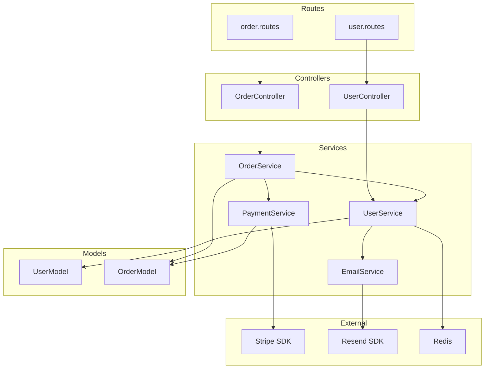
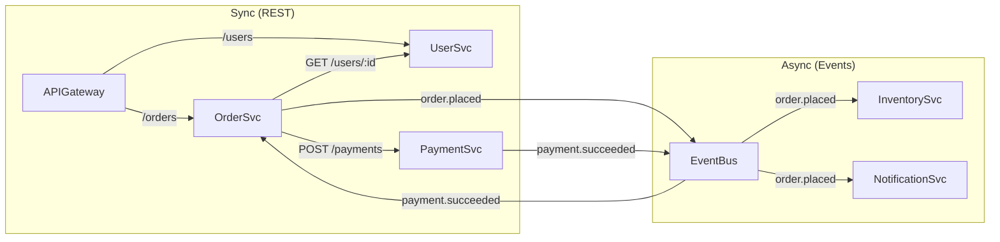

# Dependency Mapper Skill

Map, visualise, and analyse dependencies across a codebase or service mesh. Identifies circular dependencies, high-coupling hotspots, and blast radius before any refactor or change.

---

## Why Map Dependencies

```
Before any refactor, answer these questions:
  1. What modules/services does X depend on?         (outgoing deps)
  2. What modules/services depend on X?              (incoming deps — blast radius)
  3. Are there circular dependencies?                (prevents clean testing)
  4. Which modules are "hubs" (many dependents)?     (highest risk to change)
  5. Can we make a change to X without touching Y?   (decoupling analysis)
```

---

## Step 1 — Generate Dependency Map (automated)

### Node.js / TypeScript

```bash
# Install dependency-cruiser
npm install --save-dev dependency-cruiser

# Generate dependency graph (SVG)
npx depcruise src --include-only "^src" \
  --output-type dot | dot -T svg > output/docs/deps/dependency-graph.svg

# Generate JSON report for analysis
npx depcruise src --include-only "^src" \
  --output-type json > output/docs/deps/dependency-report.json

# Find circular dependencies
npx depcruise src --include-only "^src" \
  --output-type text \
  --validate .dependency-cruiser.cjs 2>&1 | grep -i "circular"

# Find what depends on a specific module
npx depcruise src --include-only "^src" \
  --output-type json \
  | jq '[.modules[] | select(.dependencies[].resolved | contains("UserService")) | .source]'
```

```javascript
// .dependency-cruiser.cjs — enforce rules
module.exports = {
  forbidden: [
    {
      name: 'no-circular',
      severity: 'error',
      comment: 'Circular dependencies make code untestable',
      from: {},
      to: { circular: true },
    },
    {
      name: 'no-cross-layer-violation',
      severity: 'error',
      comment: 'Controllers must not import from other controllers',
      from: { path: '^src/controllers' },
      to: { path: '^src/controllers' },
    },
    {
      name: 'services-not-import-controllers',
      severity: 'error',
      from: { path: '^src/services' },
      to: { path: '^src/controllers' },
    },
    {
      name: 'no-external-in-models',
      severity: 'warn',
      comment: 'Models should not depend on services',
      from: { path: '^src/models' },
      to: { path: '^src/services' },
    },
  ],
  options: {
    doNotFollow: { path: 'node_modules' },
    tsConfig: { fileName: './tsconfig.json' },
  },
};
```

### Python

```bash
# Using pydeps
pip install pydeps
pydeps src/ --max-bacon 3 --pylib False -o output/docs/deps/deps.svg

# Using pylint for circular imports
pylint src/ --disable=all --enable=cyclic-import
```

### Java / Kotlin

```bash
# Using jdepend or structure101
# Or grep-based approach:
find src/main -name "*.java" -exec grep -l "import com.company" {} \; | head -20
```

---

## Step 2 — Build the Dependency Map Document

```markdown
# Dependency Map: [Project Name]

Generated: [date]
Tool: dependency-cruiser v13 / manual analysis

---

## Service/Module Inventory

| Module | Responsibility | Layer | Dependents | Dependencies |
|---|---|---|---|---|
| UserController | HTTP user endpoints | Controller | Routes | UserService, validate |
| UserService | User business logic | Service | UserController, OrderService | UserModel, Redis, EmailService |
| UserModel | User DB schema | Model | UserService | sequelize |
| OrderService | Order business logic | Service | OrderController | UserService, OrderModel, PaymentService |
| PaymentService | Payment processing | Service | OrderService | Stripe SDK, OrderModel |
| EmailService | Transactional email | Service | UserService, OrderService | Resend SDK |

---

## Dependency Graph (by layer)



---

## Circular Dependencies

```
NONE FOUND ✅

OR:

CIRCULAR DEPENDENCY DETECTED ❌
  UserService → OrderService → UserService
  Path: src/services/UserService.ts
        → src/services/OrderService.ts
        → src/services/UserService.ts

  Fix: Extract shared logic into a new UserCoreService
       OR use dependency injection to break the cycle
       OR move the UserService call in OrderService to a parameter
```

---

## High-Risk Modules (Hub Analysis)

Modules with many dependents = high blast radius if changed:

| Module | Incoming Deps | Risk | Recommendation |
|---|---|---|---|
| UserService | 6 modules | 🔴 HIGH | Never change interface without full test coverage |
| AppError (utils) | 18 modules | 🔴 HIGH | Interface is stable — add only, never change |
| db.config | 12 modules | 🟡 MEDIUM | Changes require DB migration plan |
| validate (middleware) | 8 modules | 🟡 MEDIUM | Test all routes after changes |
| EmailService | 3 modules | 🟢 LOW | Safe to change with unit tests |

---

## Layer Violation Analysis

```
Violations found:
  ❌ src/models/Order.ts imports from src/services/UserService.ts
     → Models must not depend on Services
     → Fix: Pass userId as parameter instead of fetching user in model hook

  ⚠️ src/controllers/UserController.ts calls sequelize directly
     → Controllers should not access DB directly
     → Fix: Move query to UserService

No violations (clean): ✅
```

---

## Impact Analysis: "If I change X..."

```markdown
## Impact: Changing UserService.getById() signature

Current: getById(id: string): Promise<User>
Proposed: getById(id: string, options?: { include: string[] }): Promise<User>

Direct dependents (must review):
  1. src/controllers/UserController.ts → getById call on line 23
  2. src/services/OrderService.ts     → getById call on line 67, 89
  3. src/services/PaymentService.ts   → getById call on line 34

Indirect dependents (check for behavioral changes):
  4. tests/unit/UserService.test.ts   → mock must be updated
  5. tests/integration/UserRoutes.test.ts → may need to update assertions

Risk assessment: LOW — adding optional parameter, backward compatible
Action: Update tests, no breaking change to callers
```

---

## Microservice Dependency Map

For multi-service architectures:



| Service | Sync Deps | Async Publishes | Async Consumes |
|---|---|---|---|
| OrderService | UserService, PaymentService | order.placed, order.cancelled | payment.succeeded, payment.failed |
| PaymentService | — | payment.succeeded, payment.failed | order.placed |
| UserService | — | user.created | — |
| NotificationService | — | — | order.placed, payment.succeeded |

**Breaking change rule:** If Service A depends on Service B synchronously,
changing Service B's response schema = breaking change for A.
Always version your APIs and use consumer-driven contract tests.
```

---

## Pre-Refactor Checklist

Before touching any module with 3+ dependents:

- [ ] Run `npx depcruise` — confirm no new circulars introduced
- [ ] List all direct and indirect dependents
- [ ] Check test coverage on each dependent (> 70% required)
- [ ] Write impact analysis document
- [ ] Get review from owners of dependent modules
- [ ] Plan rollout: feature flag or direct replace?
- [ ] Update dependency map after refactor complete
