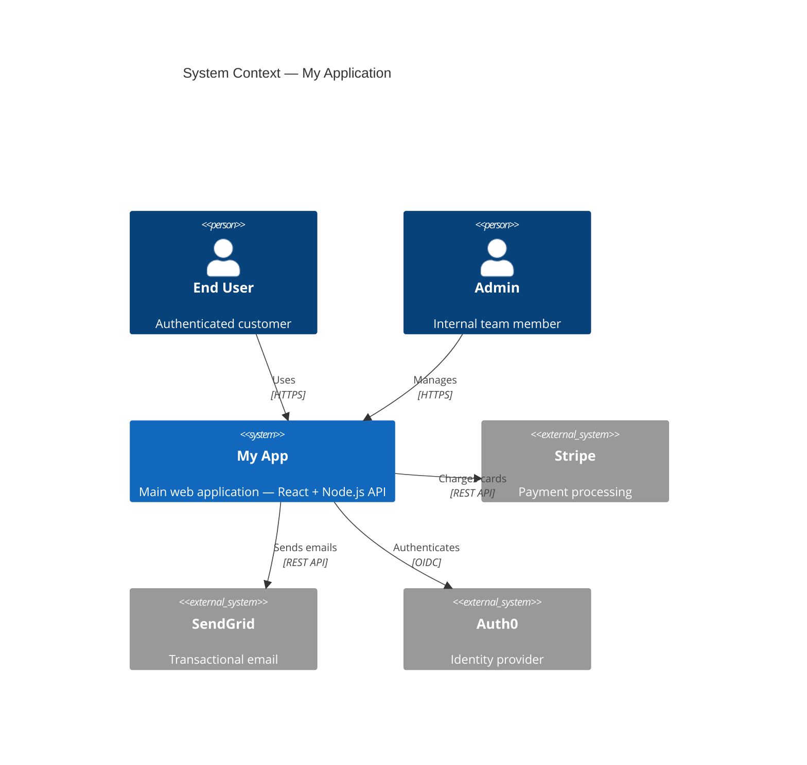
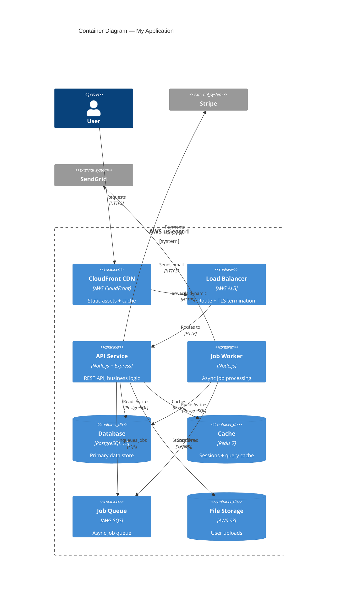
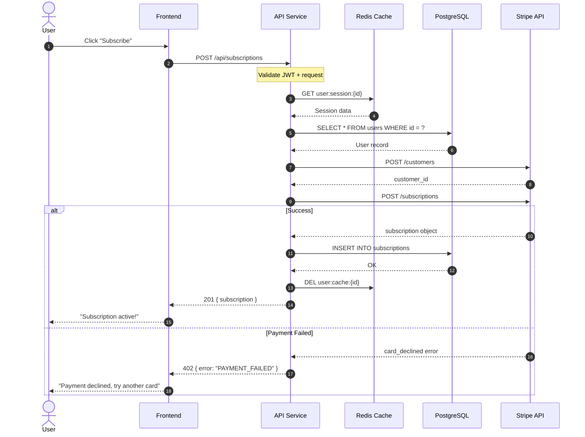
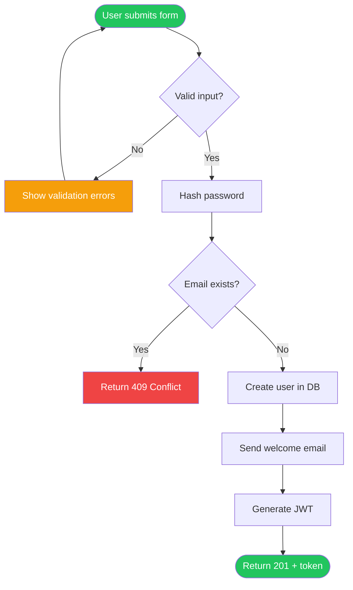
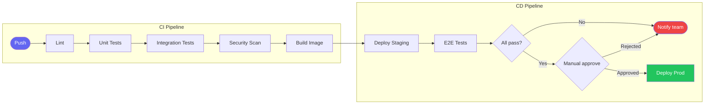
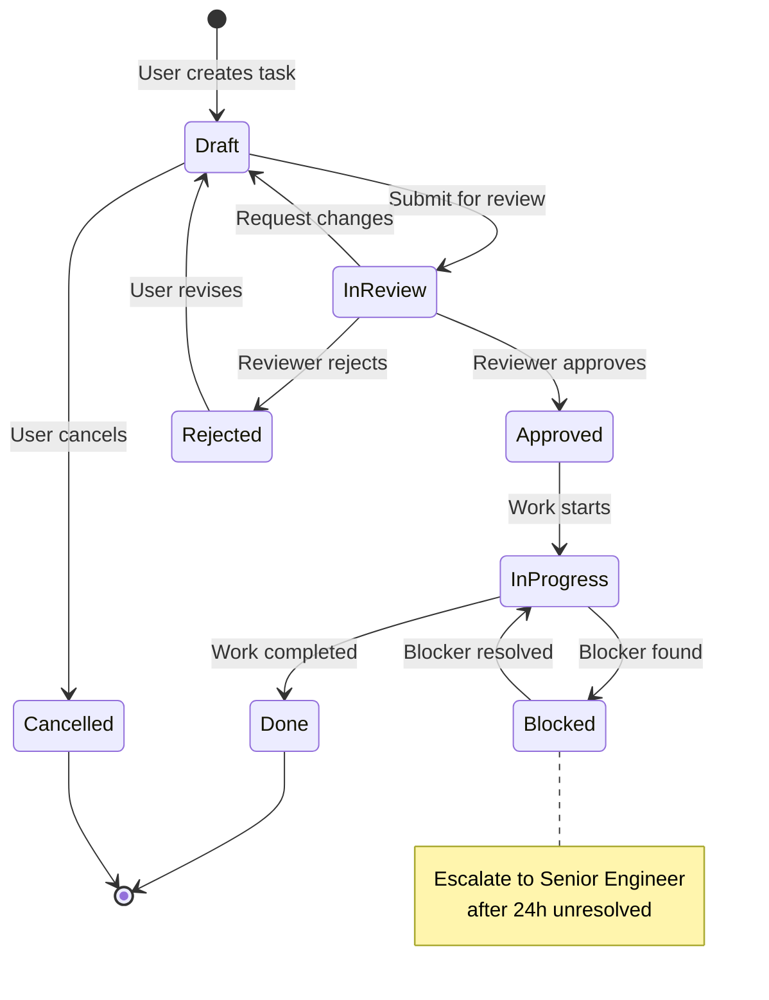
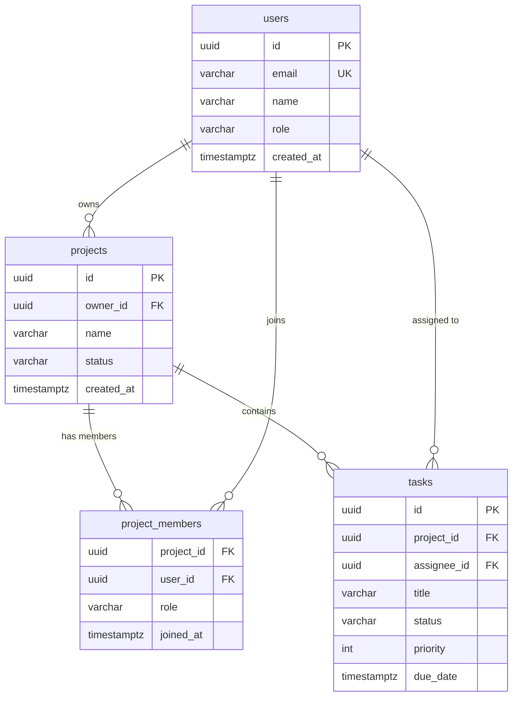
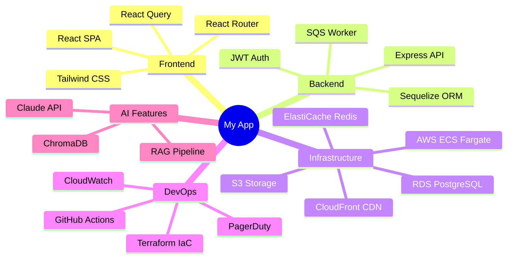

# Diagram Writer Skill

Produce clear, accurate technical diagrams as Mermaid code. Diagrams render in GitHub, GitLab, Notion, Confluence, and most modern documentation tools.

---

## Diagram Type Selection

```
System architecture    → C4 Context or Container diagram
Service interactions   → Sequence diagram
Data flow              → Flowchart (LR direction)
Database structure     → ERD
State machine          → State diagram
CI/CD pipeline         → Flowchart (TD direction)
Team/component ownership → Mindmap or flowchart
API call sequence      → Sequence diagram
Decision tree          → Flowchart
Infrastructure         → C4 Deployment or flowchart
```

---

## System Architecture (C4 Context)



---

## Service Architecture (C4 Container)



---

## Sequence Diagrams (API flows)



---

## Flowcharts (processes, pipelines, decisions)





---

## State Diagrams



---

## ERD (Database)



---

## Mindmap (system components / ownership)



---

## Diagram Quality Rules

```
1. TITLE every diagram — tells reader what they're looking at
2. LESS IS MORE — max 12-15 nodes before it becomes unreadable
3. DIRECTION matters:
   - TD (top-down): pipelines, processes, hierarchies
   - LR (left-right): data flows, request paths
   - Sequence: interactions between actors over time
4. USE SUBGRAPHS to group related components
5. COLOR sparingly: green=success/start, red=error/end, yellow=warning
6. LABELS on arrows tell readers WHAT flows, not just that it flows
   ❌ A --> B
   ✅ A -->|"User data (JWT)"| B
```

---

## Output Files

```
output/docs/diagrams/
  ARCH-[system]-context.md      ← C4 context diagram
  ARCH-[system]-containers.md   ← C4 container diagram
  SEQ-[flow]-sequence.md        ← Sequence diagram
  FLOW-[process]-flow.md        ← Flowchart
  ERD-[domain].md               ← Database ERD
  STATE-[entity]-states.md      ← State machine

Each file format:
  # [Diagram Title]
  [1-sentence description of what this shows]
  
  ```mermaid
  [diagram code]
  ```
  
  ## Key Points
  [2-3 bullets explaining non-obvious aspects]
```
