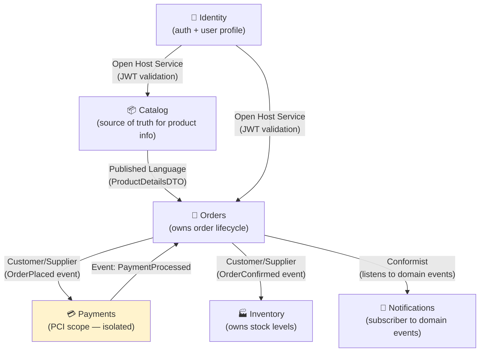

# Domain-Driven Design Skill

Apply DDD strategic and tactical patterns to design systems that match business reality. Primary use: service boundary discovery for microservices, and structuring complex domain logic.

---

## Strategic DDD (service decomposition)

### Step 1 — Discover the Ubiquitous Language

Before drawing any boundaries, establish shared vocabulary with domain experts:

```
Interview format (30-60 min per domain expert):
  "Walk me through what happens when a customer places an order"
  "What do you call X in your team?" (same thing, different names = boundary clue)
  "When does X become Y?" (state transitions reveal aggregates)
  "Who's responsible for X?" (ownership reveals team → service boundary)
  "What data does team A need from team B?" (coupling = integration needed)

Capture a Glossary per candidate bounded context:
  Order:        A confirmed purchase with payment intent
  Cart:         A temporary collection of items — NOT the same as Order
  Customer:     A registered user who has made ≥1 purchase
  Shopper:      Any user browsing — NOT the same as Customer

⚠️  Same word, different meanings in different contexts = BOUNDARY FOUND
    "Product" in Catalog = { name, images, description }
    "Product" in Warehouse = { SKU, location, quantity }
    "Product" in Billing = { price, tax-code, discount-rules }
    → Three bounded contexts, each owns its "product" concept
```

---

### Step 2 — Identify Bounded Contexts

```
A Bounded Context is:
  ✅ A clear linguistic boundary (ubiquitous language is consistent inside)
  ✅ A team ownership boundary (one team owns it)
  ✅ A deployment boundary (can change independently)
  ✅ A data boundary (owns its data, shares nothing at DB level)

Bounded Context Discovery Heuristics:
  1. Different words for same thing across teams = separate contexts
  2. Same word means different things = separate contexts
  3. "That's not our responsibility" = boundary between contexts
  4. Different change frequency (catalog changes weekly, billing monthly) = separate
  5. Different scaling needs (search 1000×/s, admin 1/s) = separate
  6. Different failure tolerance (payments MUST work, recommendations can fail) = separate
```

**Context Map (document ALL context relationships)**:



**Relationship types to document:**
| Pattern | Meaning | Implementation |
|---|---|---|
| Partnership | Both teams evolve together | Shared planning, coordinated releases |
| Customer/Supplier | Downstream makes requests of upstream | Upstream commits to downstream needs |
| Conformist | Downstream adopts upstream model | No translation layer |
| Anti-Corruption Layer (ACL) | Downstream translates upstream model | Adapter/translator in downstream |
| Open Host Service | Upstream publishes a formal API | REST/gRPC with versioning |
| Published Language | Shared exchange format | OpenAPI / AsyncAPI / shared types package |
| Shared Kernel | Both contexts share a small model | Use sparingly — creates coupling |
| Separate Ways | No integration | Explicitly documented non-integration |

---

### Step 3 — Validate Boundaries (run before committing)

```
Boundary validation checklist:
  [ ] "Can this context deploy without coordinating with another?" YES
  [ ] "Can a team change this context's internals without telling other teams?" YES
  [ ] "Does this context own ALL the data it needs (no FK dependencies on other context's DB)?" YES
  [ ] "Is the API surface of this context smaller than its internals?" YES
  [ ] "Does this context have a single, clear responsibility that fits one sentence?" YES
  [ ] "Could this context be scaled independently if needed?" YES

Red flags (rethink the boundary):
  ❌ Context A must always be deployed with Context B
  ❌ Context A queries Context B's database directly
  ❌ Context A's API surface is as large as its internals
  ❌ "It depends" when asked who owns a concept
  ❌ The context does two clearly different things (split it)
  ❌ The context is a single CRUD table wrapper (too small — merge up)
```

---

## Tactical DDD (code structure within a context)

### Entity

An object with identity that persists across time. Identity matters more than attributes.

```typescript
// ✅ Entity — identity is what makes it unique
class Order {
  private _id: OrderId;           // identity
  private _status: OrderStatus;   // mutable state
  private _items: OrderItem[];
  private _events: DomainEvent[]; // uncommitted domain events

  private constructor(id: OrderId, customerId: CustomerId, items: OrderItem[]) {
    this._id = id;
    this._status = OrderStatus.PENDING;
    this._items = items;
    this._events = [new OrderCreated(id, customerId, items)]; // raise event
  }

  // Factory method — validates invariants before construction
  static create(customerId: CustomerId, items: OrderItem[]): Order {
    if (items.length === 0) throw new DomainError('Order must have at least one item');
    const id = OrderId.generate();
    return new Order(id, customerId, items);
  }

  // Methods express domain operations, not CRUD
  confirm(): void {
    if (this._status !== OrderStatus.PENDING) {
      throw new DomainError('Only pending orders can be confirmed');
    }
    this._status = OrderStatus.CONFIRMED;
    this._events.push(new OrderConfirmed(this._id));
  }

  cancel(reason: string): void {
    if ([OrderStatus.SHIPPED, OrderStatus.DELIVERED].includes(this._status)) {
      throw new DomainError('Cannot cancel an order that has shipped');
    }
    this._status = OrderStatus.CANCELLED;
    this._events.push(new OrderCancelled(this._id, reason));
  }

  // Domain invariant: total always reflects item state
  get total(): Money {
    return this._items.reduce((sum, item) => sum.add(item.subtotal), Money.ZERO);
  }

  get id(): OrderId { return this._id; }
  get status(): OrderStatus { return this._status; }

  // Drain events for persistence/publishing
  pullDomainEvents(): DomainEvent[] {
    const events = [...this._events];
    this._events = [];
    return events;
  }
}
```

### Value Object

Immutable object defined by its attributes, not identity. Equal if attributes are equal.

```typescript
// ✅ Value Object — no identity, immutable, equality by value
class Money {
  private constructor(
    private readonly _amount: number,  // stored in cents — no floating point
    private readonly _currency: string,
  ) {}

  static of(amount: number, currency: string): Money {
    if (amount < 0) throw new DomainError('Money cannot be negative');
    if (!SUPPORTED_CURRENCIES.includes(currency)) throw new DomainError(`Unsupported currency: ${currency}`);
    return new Money(amount, currency);
  }

  static ZERO = Money.of(0, 'USD');

  add(other: Money): Money {
    if (this._currency !== other._currency) throw new DomainError('Cannot add different currencies');
    return new Money(this._amount + other._amount, this._currency);
  }

  multiply(factor: number): Money {
    return new Money(Math.round(this._amount * factor), this._currency);
  }

  equals(other: Money): boolean {
    return this._amount === other._amount && this._currency === other._currency;
  }

  get amount(): number { return this._amount; }
  get currency(): string { return this._currency; }
  get formatted(): string {
    return new Intl.NumberFormat('en-US', {
      style: 'currency', currency: this._currency,
    }).format(this._amount / 100);
  }
}

// Other Value Objects: Email, PhoneNumber, Address, CustomerId, OrderId
class Email {
  private constructor(private readonly _value: string) {}

  static of(value: string): Email {
    if (!/^[^\s@]+@[^\s@]+\.[^\s@]+$/.test(value)) throw new DomainError('Invalid email');
    return new Email(value.toLowerCase());
  }

  equals(other: Email): boolean { return this._value === other._value; }
  get value(): string { return this._value; }
}
```

### Aggregate

A cluster of entities and value objects with one root. Consistency boundary. Persist atomically.

```typescript
// Aggregate Root — the only entry point to the cluster
// Everything inside an aggregate is consistent as a unit
class ShoppingCart {  // Aggregate Root
  private _id: CartId;
  private _customerId: CustomerId;
  private _items: Map<ProductId, CartItem>;  // CartItem = entity inside aggregate
  private _events: DomainEvent[];

  // Business invariant: cart cannot exceed 50 items
  private static readonly MAX_ITEMS = 50;

  addItem(productId: ProductId, price: Money, quantity: number): void {
    if (this._items.size >= ShoppingCart.MAX_ITEMS && !this._items.has(productId)) {
      throw new DomainError('Cart cannot contain more than 50 distinct items');
    }
    if (quantity < 1) throw new DomainError('Quantity must be at least 1');

    const existing = this._items.get(productId);
    if (existing) {
      existing.increaseQuantity(quantity);
    } else {
      this._items.set(productId, new CartItem(productId, price, quantity));
    }
    this._events.push(new CartItemAdded(this._id, productId, quantity));
  }

  removeItem(productId: ProductId): void {
    if (!this._items.has(productId)) throw new DomainError('Item not in cart');
    this._items.delete(productId);
    this._events.push(new CartItemRemoved(this._id, productId));
  }

  // Checkout creates an Order aggregate — crosses aggregate boundary correctly
  checkout(): Order {
    if (this._items.size === 0) throw new DomainError('Cannot checkout empty cart');
    const items = Array.from(this._items.values()).map(i => i.toOrderItem());
    return Order.create(this._customerId, items);
  }
}

// Rules for aggregates:
// 1. Only access items through the root (CartItem only via ShoppingCart)
// 2. One transaction = one aggregate (never span aggregates in one transaction)
// 3. Reference other aggregates by ID only (not by object reference)
// 4. Keep aggregates small — if it has > 5 entities, it's probably two aggregates
```

### Repository

Persistence abstraction for an aggregate. One repository per aggregate root.

```typescript
// Repository Interface (domain layer — no DB knowledge)
interface IOrderRepository {
  findById(id: OrderId): Promise<Order | null>;
  findByCustomer(customerId: CustomerId, filters?: OrderFilters): Promise<Order[]>;
  save(order: Order): Promise<void>;            // save = create OR update
  delete(id: OrderId): Promise<void>;
}

// Repository Implementation (infrastructure layer)
class PostgresOrderRepository implements IOrderRepository {
  constructor(private readonly db: Sequelize) {}

  async findById(id: OrderId): Promise<Order | null> {
    const row = await OrderModel.findByPk(id.value, { include: [OrderItemModel] });
    if (!row) return null;
    return OrderMapper.toDomain(row);  // mapper converts DB row → domain object
  }

  async save(order: Order): Promise<void> {
    const data = OrderMapper.toPersistence(order);
    await OrderModel.upsert(data);
    await OrderItemModel.destroy({ where: { orderId: order.id.value } });
    await OrderItemModel.bulkCreate(data.items);

    // Publish domain events after save
    const events = order.pullDomainEvents();
    await this.eventBus.publishAll(events);
  }
}
```

### Domain Service

Business logic that doesn't naturally belong to any single entity or value object.

```typescript
// Use a Domain Service when:
// - The operation involves multiple aggregates
// - The operation is pure business logic with no natural "home"
// - Putting it on an entity would make it aware of things outside its aggregate

class OrderFulfillmentService {  // Domain Service
  constructor(
    private readonly orderRepo: IOrderRepository,
    private readonly inventoryClient: IInventoryService,  // ACL to inventory context
  ) {}

  // This naturally belongs here: it spans Order aggregate + Inventory context
  async fulfillOrder(orderId: OrderId): Promise<void> {
    const order = await this.orderRepo.findById(orderId);
    if (!order) throw new DomainError('Order not found');

    // Check inventory (crosses context boundary via ACL)
    const available = await this.inventoryClient.checkAvailability(
      order.items.map(i => ({ productId: i.productId, quantity: i.quantity }))
    );

    if (!available.allInStock) {
      order.markBackordered(available.outOfStockItems);
    } else {
      order.confirmFulfillment();
      await this.inventoryClient.reserve(order.items); // reserve in inventory context
    }

    await this.orderRepo.save(order);
  }
}
```

### Domain Events

Facts that happened in the domain. Published after aggregate state changes.

```typescript
// Domain events are named in past tense — they happened
abstract class DomainEvent {
  readonly occurredAt: Date = new Date();
  abstract readonly eventType: string;
}

class OrderPlaced extends DomainEvent {
  readonly eventType = 'order.placed';
  constructor(
    readonly orderId: string,
    readonly customerId: string,
    readonly items: Array<{ productId: string; quantity: number; price: number }>,
    readonly total: number,
  ) { super(); }
}

class PaymentProcessed extends DomainEvent {
  readonly eventType = 'payment.processed';
  constructor(
    readonly orderId: string,
    readonly amount: number,
    readonly paymentMethod: string,
  ) { super(); }
}

// Event routing: domain events → integration events → message broker
// Domain event: internal, rich with domain concepts
// Integration event: published externally, stable contract, minimal data

class OrderPlacedIntegrationEvent {
  // Stripped down for external consumers — no internal domain details
  constructor(
    readonly orderId: string,
    readonly customerId: string,
    readonly totalCents: number,
    readonly currency: string,
    readonly occurredAt: Date,
  ) {}
}
```

---

## Folder Structure (per bounded context)

```
src/
  [bounded-context]/           ← e.g. orders/, catalog/, payments/
    domain/
      entities/
        Order.ts               ← Aggregate root
        OrderItem.ts           ← Entity within aggregate
      value-objects/
        Money.ts
        OrderId.ts
        OrderStatus.ts
      events/
        OrderPlaced.ts
        OrderConfirmed.ts
        OrderCancelled.ts
      services/
        OrderFulfillmentService.ts   ← Domain service
      repositories/
        IOrderRepository.ts          ← Interface only (no DB)
      errors/
        OrderNotFoundError.ts
        InvalidOrderStateError.ts

    application/               ← Use cases / application services
      commands/
        PlaceOrderCommand.ts
        CancelOrderCommand.ts
      handlers/
        PlaceOrderHandler.ts
        CancelOrderHandler.ts
      queries/
        GetOrderQuery.ts
        GetOrderHandler.ts

    infrastructure/            ← Framework-specific implementations
      persistence/
        OrderModel.ts          ← Sequelize/TypeORM model
        PostgresOrderRepository.ts
        OrderMapper.ts         ← Domain ↔ DB row conversion
      http/
        OrderController.ts     ← HTTP → Application layer
        OrderRoutes.ts
      messaging/
        OrderEventPublisher.ts ← Publishes domain events to broker

    index.ts                   ← Public API of this bounded context
```

---

## DDD Anti-Patterns

```
❌ Anaemic Domain Model: Entities are just data bags, all logic in services
   Fix: Move logic INTO entities where it belongs to that entity's invariants

❌ Entities reaching across aggregate boundaries:
   order.customer.address.update(...)   ← wrong
   Fix: Only hold a reference (customerId), fetch via repository when needed

❌ Repository with dozens of query methods (findByXAndYAndZ...):
   Fix: Limit to findById, findBy[aggregate-natural-key], save. 
        For queries, use a separate Query Model (CQRS read side).

❌ Domain events published before save (DB might fail):
   Fix: Raise events inside aggregate, publish AFTER repository.save() completes

❌ Sharing DB tables across bounded contexts:
   Fix: Each context has its own schema. Share data via API or events only.

❌ Too many aggregates per transaction:
   Fix: One transaction = one aggregate. Use eventual consistency via events.
```
