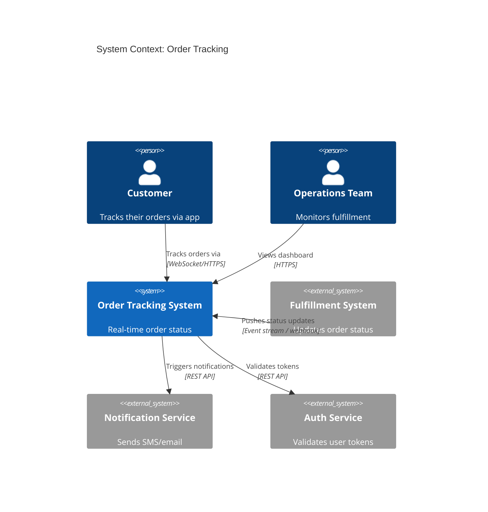
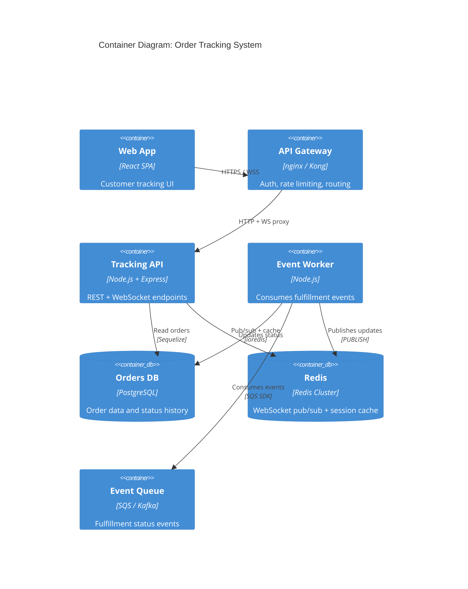

# HLD Writer Skill

Produce comprehensive High-Level Design documents. HLD defines the what and why of a system at architectural level — service boundaries, data flows, technology choices, trade-offs, and capacity planning — before any LLD or implementation begins.

---

## HLD vs LLD

```
HLD (this skill):              LLD (lld-writer skill):
──────────────────────         ──────────────────────────
System-level view              Component-level view
WHY these services exist       HOW each class is structured
Technology selection           Method signatures + types
Service boundaries             DB column definitions
Data flow between services     API request/response schemas
Non-functional requirements    Business logic rules
Capacity estimates             Unit test plan
Risk and trade-off analysis    Implementation checklist
Written before LLD             Written after HLD approved
```

---

## HLD Document Template

```markdown
# High-Level Design: [System / Feature Name]

**Author:** HLD Architect
**Date:** [YYYY-MM-DD]
**Status:** Draft → Review → Approved
**Related PRD:** [link]
**Reviewers:** CTO, Backend Architect, DevOps Engineer, Security Analyst

---

## 1. Executive Summary

[3-5 sentences: what we're building, why, and the key architectural decision.
Non-technical stakeholders should understand this section.]

Example:
"We are building a real-time order tracking system that allows customers to
see live updates as their orders move through fulfillment. The system must
handle 50k concurrent connections at peak. We will use WebSockets (Socket.io)
on dedicated tracking servers with Redis pub/sub to fan out status updates
from our fulfillment service."

---

## 2. Goals and Non-Goals

### Goals
- [ ] [Specific, measurable goal 1]
- [ ] [Specific, measurable goal 2]

### Non-Goals (Explicitly out of scope for v1)
- [What we are NOT building — prevents scope creep]

### Success Criteria
| Metric | Current | Target | Measurement |
|---|---|---|---|
| p95 API latency | N/A | < 200ms | APM dashboard |
| Uptime | N/A | 99.9% | PagerDuty |
| Concurrent users | N/A | 10,000 | Load test |

---

## 3. Background and Context

### Current State
[What exists today — architecture, pain points, constraints]

### Why Now
[What's forcing this design — scale, new product requirement, tech debt]

### Constraints
- **Technical:** [Must use existing auth service / Cannot change DB schema]
- **Time:** [Must ship by Q3 — some complexity deferred to v2]
- **Cost:** [Monthly infra budget ceiling: $X]
- **Team:** [2 backend engineers, 1 DevOps — no ML expertise]

---

## 4. System Architecture

### C4 Context Diagram



### C4 Container Diagram



---

## 5. Service Descriptions

| Service | Responsibility | Technology | Scaling |
|---|---|---|---|
| API Gateway | Auth validation, rate limiting, SSL termination | nginx + Kong | Horizontal, stateless |
| Tracking API | WebSocket connections, REST endpoints | Node.js 20, Express, Socket.io | Horizontal (Redis adapter) |
| Event Worker | Consume fulfillment events, update DB, broadcast | Node.js, BullMQ consumer | Horizontal (independent) |
| Orders DB | Source of truth for order state | PostgreSQL 15 (RDS Multi-AZ) | Vertical + read replicas |
| Redis | WebSocket pub/sub, session/cache | Redis 7 Cluster | Horizontal cluster |
| Event Queue | Durable fulfillment event buffer | AWS SQS FIFO | Managed, auto-scaling |

---

## 6. Data Architecture

### Data Flow Diagram

```mermaid
flowchart LR
  A[Fulfillment System] -->|status update| B[SQS FIFO Queue]
  B -->|consume| C[Event Worker]
  C -->|UPDATE order status| D[(PostgreSQL)]
  C -->|PUBLISH order:{id}| E[(Redis Pub/Sub)]
  E -->|broadcast| F[Tracking API instances]
  F -->|emit over WebSocket| G[Connected Clients]
```

### Data Ownership

| Data | Owner Service | Storage | Access Pattern |
|---|---|---|---|
| Order records | Tracking API | PostgreSQL | Read-heavy, occasional write |
| Status history | Tracking API | PostgreSQL | Append-only |
| Active WS sessions | Tracking API | Redis (TTL 1h) | High-frequency read/write |
| Fulfillment events | Event Worker | SQS (consumed) | Sequential consume |

---

## 7. Key Design Decisions

For each major decision, document as a mini-ADR:

### Decision 1: WebSocket vs SSE for real-time updates

| Factor | WebSocket | SSE |
|---|---|---|
| Bidirectional | ✅ Yes | ❌ No (server→client only) |
| Client support | ✅ All browsers | ✅ All modern browsers |
| Infra complexity | Medium (socket server) | Low (HTTP stream) |
| Horizontal scale | Needs Redis adapter | Stateless |
| Use case fit | Chat, collab | ✓ One-way push |

**Decision:** SSE for order status (one-way, simpler). WebSocket only if we add two-way chat.
**Consequences:** Simpler infra, no Redis adapter needed for v1.

### Decision 2: SQS vs Kafka for fulfillment events

| Factor | SQS FIFO | Kafka |
|---|---|---|
| Ops overhead | Low (managed) | High (self-managed or MSK) |
| Throughput | 3,000 msg/s (FIFO) | 1M+ msg/s |
| Message retention | 14 days | Configurable (days to forever) |
| Replay capability | ❌ Once consumed | ✅ Replay by offset |
| Cost (10M msg/mo) | ~$4 | MSK ~$200+/month |

**Decision:** SQS FIFO for v1 (volume < 1k events/min, ops simplicity, cost).
**Revisit if:** Event volume > 50k/min or replay needed for ML/analytics.

---

## 8. Non-Functional Requirements

### Performance
| Requirement | Target | Rationale |
|---|---|---|
| REST API p95 latency | < 200ms | Acceptable for UI responsiveness |
| WebSocket/SSE event delivery | < 500ms end-to-end | "Real-time" perception |
| Status update fanout | < 2s worst case | SQS delay + processing + broadcast |

### Scalability
```
Peak load estimate:
  - 50,000 concurrent WebSocket connections
  - 5,000 order status updates/minute
  - 200 REST API requests/second

Scaling strategy:
  - Tracking API: horizontal (stateless with Redis adapter)
  - Event Worker: horizontal (N consumers, FIFO order per order ID)
  - PostgreSQL: read replica for GET endpoints
  - Redis: cluster mode for pub/sub scale
```

### Availability
```
Target: 99.9% uptime (8.7 hours downtime/year)
  - Multi-AZ PostgreSQL (RDS)
  - Redis Cluster (3 nodes, 1 replica each)
  - API instances: min 2, across 2 AZs
  - SQS: AWS-managed, 99.999% SLA

Single points of failure:
  - Redis: mitigated by cluster + persistence
  - PostgreSQL: Multi-AZ automatic failover
```

### Security
```
- All connections over TLS (HTTPS / WSS)
- JWT validation at API Gateway (no token → reject before service)
- Users can only track their own orders (RBAC in service)
- No PII in Redis (store order IDs only, resolve from DB)
- SQS messages signed (AWS IAM)
- Rate limiting: 100 req/min per user
```

---

## 9. API Surface

High-level API definition (detailed contracts in LLD):

```
REST:
  GET  /api/orders/:id/status    → Current status + history
  GET  /api/orders               → User's orders (paginated)

SSE/WebSocket:
  GET  /api/orders/:id/stream    → Live status updates stream
  
Internal (service-to-service):
  POST /internal/orders/:id/status → Update status (from Event Worker)
                                     Auth: service API key, not user JWT
```

---

## 10. Infrastructure Overview

```
AWS us-east-1:
  VPC (10.0.0.0/16)
    Public subnets (2 AZ):  ALB, NAT Gateway
    Private subnets (2 AZ): ECS services, RDS, ElastiCache

  ECS Fargate:
    tracking-api:   min 2, max 10 tasks × (0.5 vCPU, 1GB RAM)
    event-worker:   min 1, max 5 tasks  × (0.25 vCPU, 512MB RAM)

  RDS PostgreSQL:  db.t3.medium, Multi-AZ, 100GB gp3
  ElastiCache:     cache.r7g.large × 3 (Redis cluster)
  SQS FIFO:        order-status-events.fifo

  Estimated monthly cost: $380-480 at expected load
```

---

## 11. Risks and Mitigations

| Risk | Probability | Impact | Mitigation |
|---|---|---|---|
| Redis cluster unavailable | Low | High | Graceful degrade: REST polling fallback |
| SQS message duplication | Medium | Low | Idempotent status updates (check current status before update) |
| DB connection exhaustion | Low | High | Connection pool + pgBouncer |
| Event Worker lag > 30s | Medium | Medium | Dead letter queue + alert at > 100 messages queued |
| WebSocket auth token expiry | High | Low | Refresh via parallel REST call |

---

## 12. Migration Plan (if replacing existing system)

```
Phase 1 (week 1-2): New system built, tested in staging
Phase 2 (week 3):   Shadow mode — new system processes events, old system still primary
Phase 3 (week 4):   Gradual traffic shift: 10% → 50% → 100% via feature flag
Phase 4:            Old system decommissioned after 2 weeks stable operation
Rollback:           Feature flag → 0%, old system back in < 5 minutes
```

---

## 13. Open Questions

| # | Question | Owner | Due | Blocks |
|---|---|---|---|---|
| 1 | Should SSE or WebSocket be used? | HLD Architect | [date] | Architecture |
| 2 | Kafka vs SQS at 2× growth? | CTO | [date] | Infra sizing |
| 3 | GDPR: how long to retain status history? | Legal/PM | [date] | DB schema |

---

## HLD Review Sign-offs Required

- [ ] CTO: architecture direction approved
- [ ] Backend Architect: service design approved
- [ ] DevOps Engineer: infra design approved
- [ ] Security Analyst: security design approved
- [ ] DB Architect: data model approved
- [ ] PM: NFRs meet product requirements

**→ After all sign-offs: create LLD for each service**
```

---

## HLD Quality Checklist (reviewer uses this)

- [ ] C4 context + container diagrams present and accurate
- [ ] Every service has defined responsibility (single reason to exist)
- [ ] Data ownership is clear — no service owns data it doesn't need
- [ ] All design decisions have documented alternatives + rationale
- [ ] NFRs are quantified (latency in ms, uptime as %, scale as req/s)
- [ ] Capacity estimates back the infrastructure choice
- [ ] Single points of failure identified with mitigations
- [ ] Open questions have owners and due dates
- [ ] Cost estimate included
- [ ] Migration strategy defined if replacing existing system
