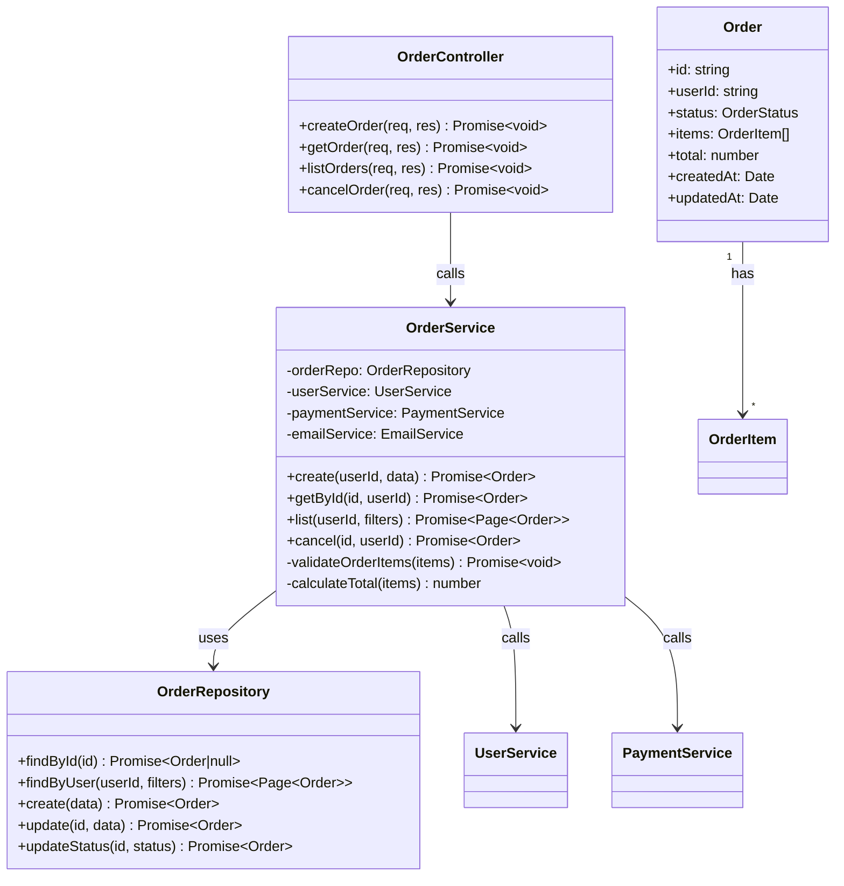
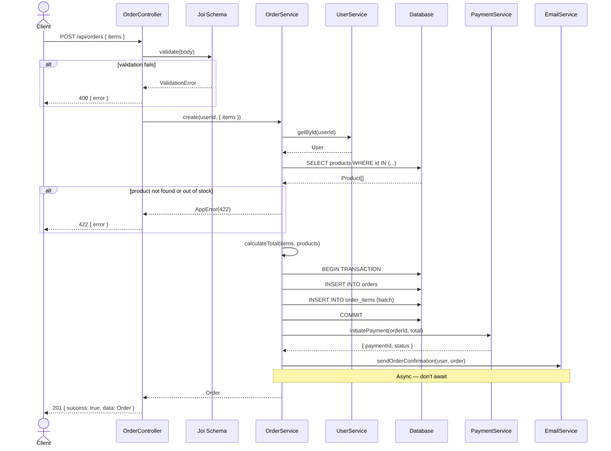
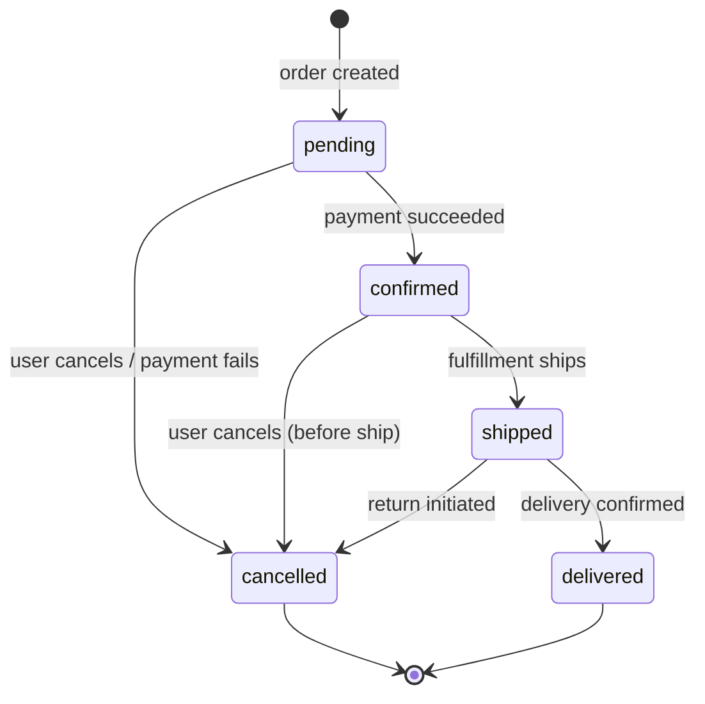

# LLD Writer Skill

Produce precise, implementation-ready Low-Level Design documents. An LLD defines exactly what to build: class structures, method signatures, data flows, DB schema, API contracts, and error handling — before a line of code is written.

---

## When LLD is Required

```
Required (always):
  - New service or major module (> 3 files)
  - Feature touching 3+ existing files
  - DB schema changes
  - New API endpoints (> 2 endpoints)
  - Any async/event-driven flow
  - Integrating a third-party service

Optional (team decides):
  - Simple CRUD with clear analog
  - Bug fixes
  - Config changes
  - Pure UI styling
```

---

## LLD Document Template

```markdown
# Low-Level Design: [Component / Feature Name]

**Author:** [LLD Designer]
**Date:** [YYYY-MM-DD]
**Status:** Draft → Review → Approved
**Related HLD:** [link if exists]
**Related PRD:** [link if exists]
**Jira/Ticket:** [link]

---

## 1. Overview

### Purpose
[1-2 sentences: what this component does and why it exists]

### Scope
In scope:
- [Explicit list of what this LLD covers]

Out of scope:
- [Explicit exclusions — prevents scope creep during implementation]

### Dependencies
| Dependency | Type | Purpose |
|---|---|---|
| UserService | Internal service | Fetch user data for authorization |
| Redis | External cache | Store session tokens |
| SendGrid | External API | Send transactional emails |

---

## 2. Component Architecture

### Module Structure
```
[feature-name]/
  [FeatureName]Controller.ts   ← HTTP layer
  [FeatureName]Service.ts      ← Business logic
  [FeatureName]Repository.ts   ← Data access (if repo pattern)
  [FeatureName]Validator.ts    ← Input validation schemas
  [FeatureName].types.ts       ← TypeScript interfaces
  [FeatureName].test.ts        ← Unit tests
  index.ts                     ← Public exports
```

### Class Diagram (Mermaid)


---

## 3. Data Model

### Database Schema

```sql
-- orders table
CREATE TABLE orders (
  id           UUID PRIMARY KEY DEFAULT gen_random_uuid(),
  user_id      UUID NOT NULL REFERENCES users(id),
  status       VARCHAR(20) NOT NULL DEFAULT 'pending'
               CHECK (status IN ('pending','confirmed','shipped','delivered','cancelled')),
  total        DECIMAL(10,2) NOT NULL CHECK (total >= 0),
  metadata     JSONB DEFAULT '{}',
  created_at   TIMESTAMPTZ NOT NULL DEFAULT NOW(),
  updated_at   TIMESTAMPTZ NOT NULL DEFAULT NOW()
);

-- order_items table
CREATE TABLE order_items (
  id         UUID PRIMARY KEY DEFAULT gen_random_uuid(),
  order_id   UUID NOT NULL REFERENCES orders(id) ON DELETE CASCADE,
  product_id UUID NOT NULL REFERENCES products(id),
  quantity   INTEGER NOT NULL CHECK (quantity > 0),
  unit_price DECIMAL(10,2) NOT NULL CHECK (unit_price >= 0),
  created_at TIMESTAMPTZ NOT NULL DEFAULT NOW()
);

-- Indexes
CREATE INDEX idx_orders_user_id ON orders(user_id);
CREATE INDEX idx_orders_status ON orders(status);
CREATE INDEX idx_orders_created_at ON orders(created_at DESC);
CREATE INDEX idx_order_items_order_id ON order_items(order_id);
```

### TypeScript Interfaces

```typescript
// [feature].types.ts
export type OrderStatus = 'pending' | 'confirmed' | 'shipped' | 'delivered' | 'cancelled';

export interface Order {
  id: string;
  userId: string;
  status: OrderStatus;
  items: OrderItem[];
  total: number;
  metadata: Record<string, unknown>;
  createdAt: Date;
  updatedAt: Date;
}

export interface OrderItem {
  id: string;
  orderId: string;
  productId: string;
  quantity: number;
  unitPrice: number;
}

export interface CreateOrderInput {
  items: Array<{ productId: string; quantity: number }>;
}

export interface OrderFilters {
  status?: OrderStatus;
  from?: Date;
  to?: Date;
  page?: number;
  limit?: number;
}

export interface Page<T> {
  data: T[];
  total: number;
  page: number;
  limit: number;
  hasMore: boolean;
}
```

---

## 4. API Contract

### Endpoints

```
POST   /api/orders              Create a new order
GET    /api/orders              List user's orders (paginated)
GET    /api/orders/:id          Get order by ID
POST   /api/orders/:id/cancel   Cancel an order
```

### Request / Response Schemas

**POST /api/orders**
```
Request:
  Authorization: Bearer {accessToken}
  Content-Type: application/json
  Body: {
    items: [{ productId: string, quantity: number }]  // min 1 item
  }

Response 201:
  {
    success: true,
    data: Order
  }

Response 400 (validation):
  {
    success: false,
    error: "items must not be empty",
    field: "items"
  }

Response 422 (business rule):
  {
    success: false,
    error: "Product {id} is out of stock"
  }
```

**GET /api/orders**
```
Request:
  Authorization: Bearer {accessToken}
  Query: ?status=pending&page=1&limit=20&from=2024-01-01

Response 200:
  {
    success: true,
    data: {
      items: Order[],
      total: number,
      page: number,
      limit: number,
      hasMore: boolean
    }
  }
```

---

## 5. Sequence Diagrams

### Create Order Flow



### Cancel Order — State Machine



---

## 6. Error Handling

```typescript
// All errors this component throws:

// Business errors (expected, handled)
throw new AppError('Product not found', 404);
throw new AppError('Insufficient stock for product {id}', 422);
throw new AppError('Order cannot be cancelled: already shipped', 409);
throw new AppError('Access denied: order belongs to another user', 403);

// System errors (unexpected — let global handler catch)
// DB errors, network errors → bubble up → 500

// Error response shape (consistent with codebase):
{
  success: false,
  error: string,        // human-readable
  code?: string,        // machine-readable (e.g. 'INSUFFICIENT_STOCK')
  field?: string        // for validation errors
}
```

---

## 7. Business Logic Rules

```
BR-01: An order requires at least 1 item
BR-02: Order total = SUM(quantity × unit_price) — calculated server-side, never trusted from client
BR-03: Stock check must happen within the same DB transaction as order creation
BR-04: Only the order's owner can view or cancel it
BR-05: Cancellation allowed only from: pending, confirmed
BR-06: Cancelled orders cannot be reactivated
BR-07: Payment initiation is best-effort — order is created regardless
BR-08: Confirmation email is sent async — failure does not fail the order
```

---

## 8. Performance Considerations

```
- List query: always paginated (default 20, max 100)
- Product availability check: batch SELECT (not N queries)
- Order items insert: batch INSERT (not N inserts)
- Email send: async, non-blocking
- Index strategy: user_id (all user queries), status (filtering), created_at DESC (sorting)
- Cache: user data cached 5min in Redis (avoid repeat DB call per order)
```

---

## 9. Testing Plan

| Test Type | What to Cover | File |
|---|---|---|
| Unit | calculateTotal, validateOrderItems, status machine | OrderService.test.ts |
| Unit | All validation schemas (valid + invalid cases) | OrderValidator.test.ts |
| Integration | POST create → DB record exists | OrderRoutes.test.ts |
| Integration | GET list pagination | OrderRoutes.test.ts |
| Integration | Cancel state transitions | OrderRoutes.test.ts |
| Integration | Auth: 401 without token, 403 wrong user | OrderRoutes.test.ts |

---

## 10. Open Questions

| # | Question | Owner | Due | Decision |
|---|---|---|---|---|
| 1 | Should we reserve stock at order creation or at payment? | Backend Arch | [date] | Pending |
| 2 | What's the SLA for email delivery failure alerts? | PM | [date] | Pending |

---

## Implementation Checklist

- [ ] LLD reviewed and approved by Senior Engineer
- [ ] DB schema migration written and reviewed
- [ ] TypeScript interfaces match DB schema
- [ ] API contract reviewed by API Design Lead
- [ ] Security review: auth on all endpoints, RBAC checked
- [ ] All business rules have corresponding unit tests
- [ ] Error codes finalized and documented
- [ ] Open questions resolved before implementation starts
```

---

## LLD Review Checklist (reviewer uses this)

- [ ] Every class has defined responsibilities (no god classes)
- [ ] Method signatures have typed inputs and outputs
- [ ] DB schema has correct constraints, indexes, and foreign keys
- [ ] All API endpoints have request/response schemas
- [ ] Sequence diagram covers the happy path AND error paths
- [ ] State machine covers all transitions explicitly
- [ ] Business rules are numbered and testable
- [ ] No magic values — all constants named and explained
- [ ] Performance: N+1 queries eliminated in design
- [ ] Open questions are tracked with owners
