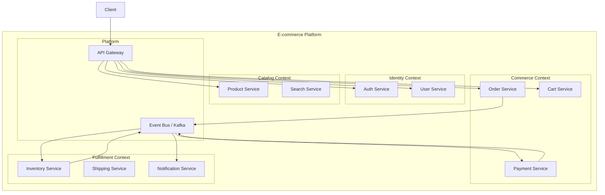

# Microservice Architect Skill

Design production microservice systems: service decomposition, communication patterns, API gateway, service discovery, distributed data, and operational concerns.

---

## Decomposition First: Should You?

```
Start with a monolith. Migrate to microservices ONLY when:
  ✅ Team > 8 engineers and independent deployments are blocked
  ✅ Specific service needs to scale independently (10× traffic delta)
  ✅ Different parts need different tech stacks (ML service in Python)
  ✅ Clear bounded contexts exist with stable interfaces between them
  ✅ You have DevOps maturity: CI/CD, observability, container platform

Do NOT migrate to microservices when:
  ❌ Team < 8 engineers
  ❌ "It's more modern/better"
  ❌ You haven't identified bounded contexts
  ❌ You don't have distributed tracing and centralized logging yet
  ❌ Your monolith is not well-tested
```

---

## Service Decomposition by Bounded Context



### Decomposition Rules

```
1. One bounded context = one or more services (not vice versa)
2. Services own their data — no shared DB between services
3. A service should be replaceable in 2 weeks by 1 engineer
4. If two services always change together, they should be one service
5. Cross-service reads = async event or API call (never shared table)
```

---

## Communication Patterns

### Synchronous (REST/gRPC) — when to use

```
Use synchronous when:
  - Client needs the response immediately to proceed
  - Request-response semantics are natural
  - Simple query with no side effects

Example: Cart service needs product price → calls Product service synchronously
```

### Asynchronous (Events) — when to use

```
Use events when:
  - Action has multiple downstream effects (fan-out)
  - Downstream service doesn't need to be available now
  - You want decoupling (Order service shouldn't know about Notifications)
  - Long-running processes (payment, fulfillment)

Example: Order placed → event published → Payment, Inventory, Notification all consume independently
```

### Communication Matrix for common operations

```
Operation                        Pattern          Why
──────────────────────────────   ─────────────    ─────────────────────
Get product details (read)       Sync REST        Immediate response needed
Place order                      Sync REST        User needs order ID now
Order → trigger payment          Async event      Payment can retry independently
Payment confirmed → ship         Async event      Multiple services need to know
Send confirmation email          Async event      Non-blocking, retryable
Check inventory availability     Sync REST        Must know before committing order
Update inventory after order     Async event      Eventual consistency acceptable
User profile lookup              Sync REST / cache Read-through cache preferred
Search query                     Sync REST        Immediate results needed
```

---

## Event Schema Design

```typescript
// Every event follows this envelope
interface DomainEvent<T = unknown> {
  // Routing
  eventType:   string;     // 'order.placed', 'payment.succeeded'
  eventVersion:string;     // '1.0' — bump on breaking schema change
  source:      string;     // 'order-service'

  // Identity
  eventId:     string;     // UUID — for deduplication
  correlationId:string;    // trace ID — threads events from same user action
  causationId: string;     // ID of event that caused this event

  // Timing
  occurredAt:  string;     // ISO 8601 UTC

  // Payload
  data:        T;
}

// Example events
interface OrderPlacedEvent extends DomainEvent<{
  orderId:  string;
  userId:   string;
  items:    Array<{ productId: string; quantity: number; unitPrice: number }>;
  total:    number;
  currency: string;
}> {
  eventType: 'order.placed';
}

interface PaymentSucceededEvent extends DomainEvent<{
  paymentId:     string;
  orderId:       string;
  amount:        number;
  currency:      string;
  paymentMethod: string;
}> {
  eventType: 'payment.succeeded';
}
```

---

## API Gateway Pattern

```typescript
// gateway/src/routes.ts — Kong / Express-Gateway / custom
// Gateway responsibilities:
//   1. Auth validation (JWT) — reject before reaching services
//   2. Rate limiting — per user, per IP
//   3. Request routing — path → service
//   4. Request/response transformation (if needed)
//   5. TLS termination
//   6. Access logging

// Kong declarative config
services:
  - name: order-service
    url: http://order-service:3001
    routes:
      - name: orders-route
        paths: [/api/v1/orders]
        methods: [GET, POST, PUT, DELETE]
    plugins:
      - name: jwt              # validates JWT, injects X-User-Id header
      - name: rate-limiting
        config:
          minute: 60
          policy: redis
      - name: correlation-id   # injects X-Correlation-Id
      - name: request-id       # injects X-Request-Id

# What gateway does NOT do:
#   ❌ Business logic
#   ❌ Data aggregation (use BFF pattern for that)
#   ❌ Direct DB access
```

---

## Service Template (Node.js)

```
service-[name]/
  src/
    routes/         HTTP routes — mounted in app.ts
    controllers/    Parse request, call service, format response
    services/       Business logic
    events/
      publishers/   Publish domain events to Kafka/SQS
      consumers/    Subscribe to events from other services
    models/         DB models (service owns its own DB)
    middleware/     Auth (trusts X-User-Id from gateway), error handler
    config/         env, db, kafka, redis
    health.ts       GET /health → { status: 'ok', uptime, version }
  tests/
  Dockerfile
  package.json
  .env.example
```

```typescript
// middleware/serviceAuth.ts
// Services trust the API gateway — validate X-User-Id header (set by gateway after JWT check)
// For internal service-to-service calls: validate X-Service-Token (shared secret or mTLS)

export function injectUser(req: Request, res: Response, next: NextFunction) {
  const userId = req.headers['x-user-id'] as string;
  if (!userId) return res.status(401).json({ error: 'No user context' });
  req.user = { id: userId };
  next();
}

export function serviceAuth(req: Request, res: Response, next: NextFunction) {
  const token = req.headers['x-service-token'];
  if (token !== process.env.SERVICE_TOKEN) {
    return res.status(403).json({ error: 'Service not authorized' });
  }
  next();
}
```

---

## Distributed Data Patterns

### Saga Pattern (distributed transaction)

```
Problem: Place order requires: reserve inventory + charge payment + confirm order
         Each step is in a different service with its own DB
         If payment fails, inventory must be released

Choreography Saga (event-based, preferred for < 5 steps):

  OrderService  → publishes: order.created
  InventoryService → consumes order.created
                  → reserves stock
                  → publishes: inventory.reserved OR inventory.insufficient
  PaymentService → consumes inventory.reserved
                 → charges payment
                 → publishes: payment.succeeded OR payment.failed
  OrderService  → consumes payment.succeeded → confirms order
                → consumes payment.failed    → cancels order
  InventoryService → consumes order.cancelled → releases stock

Compensation (rollback):
  Each step must have a compensating action:
    inventory.reserved   → compensation: inventory.released
    payment.succeeded    → compensation: payment.refunded
  Store saga state in each service to know which compensations to run
```

---

## Observability for Microservices

```typescript
// Every service must emit:

// 1. Structured logs with correlation ID
logger.info({
  correlationId: req.headers['x-correlation-id'],
  service: 'order-service',
  action: 'order.create',
  userId: req.user.id,
  duration: Date.now() - start,
});

// 2. Distributed traces (OpenTelemetry)
import { trace } from '@opentelemetry/api';
const span = trace.getActiveSpan();
span?.setAttribute('order.id', order.id);
span?.setAttribute('user.id', userId);

// 3. Business metrics
metrics.increment('orders.created', { currency });
metrics.histogram('order.total', total, { currency });
```

---

## Health Check Standard

```typescript
// Every service exposes GET /health
// Used by: load balancer, K8s liveness probe, service mesh

router.get('/health', async (req, res) => {
  const checks = await Promise.allSettled([
    db.query('SELECT 1'),       // DB connectivity
    redis.ping(),               // Cache connectivity
    // Add: kafka connectivity, external API checks
  ]);

  const healthy = checks.every(c => c.status === 'fulfilled');

  res.status(healthy ? 200 : 503).json({
    status:    healthy ? 'healthy' : 'degraded',
    version:   process.env.npm_package_version,
    uptime:    process.uptime(),
    timestamp: new Date().toISOString(),
    checks: {
      database: checks[0].status === 'fulfilled' ? 'ok' : 'error',
      redis:    checks[1].status === 'fulfilled' ? 'ok' : 'error',
    },
  });
});
```

---

## Microservice Readiness Checklist

Before shipping any microservice to production:

```
Architecture:
  [ ] Bounded context clearly defined — one reason to exist
  [ ] Owns its own DB — no shared tables with other services
  [ ] API contract documented (OpenAPI spec)
  [ ] All events published are documented with schema

Communication:
  [ ] Sync calls have timeouts (never infinite wait)
  [ ] Retry with exponential backoff on transient failures
  [ ] Circuit breaker on downstream dependencies
  [ ] Idempotent endpoints (safe to retry POST/PUT)

Observability:
  [ ] Structured logging with correlation IDs
  [ ] Distributed tracing (OpenTelemetry)
  [ ] /health endpoint
  [ ] Key business metrics emitted
  [ ] Alerts configured for error rate and latency

Operations:
  [ ] Dockerfile (multi-stage, non-root user)
  [ ] K8s manifests or ECS task definition
  [ ] Environment variables documented in .env.example
  [ ] Graceful shutdown (drain connections on SIGTERM)
  [ ] Zero-downtime deployment tested
  [ ] Runbook written
```
