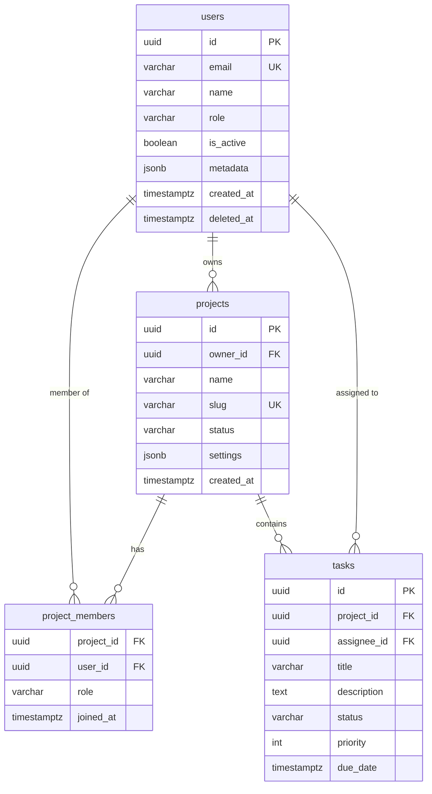

# Schema Designer Skill

Design precise data schemas for databases, APIs, and message contracts. Produce schemas that developers can implement directly and consumers can trust completely.

---

## Process: Questions Before Schema

Before designing any schema, clarify:
```
1. What are the core entities? (nouns in the domain)
2. What are the relationships? (one-to-one, one-to-many, many-to-many)
3. What queries must be fast? (drives indexes and denormalization)
4. What is the read/write ratio? (affects normalization decisions)
5. What fields are required vs optional?
6. What are the validation rules for each field?
7. What changes are anticipated in v2? (design for evolution)
8. Multi-tenant? (affects row-level security design)
```

---

## Database Schema (PostgreSQL)

```sql
-- Complete annotated schema example

-- ─── Users ──────────────────────────────────────────────────
CREATE TABLE users (
    id          UUID PRIMARY KEY DEFAULT gen_random_uuid(),
    email       VARCHAR(255) NOT NULL,
    name        VARCHAR(100) NOT NULL,
    role        VARCHAR(20)  NOT NULL DEFAULT 'user'
                    CHECK (role IN ('admin', 'user', 'guest')),
    is_active   BOOLEAN NOT NULL DEFAULT true,
    metadata    JSONB,                          -- flexible extra fields
    created_at  TIMESTAMPTZ NOT NULL DEFAULT NOW(),
    updated_at  TIMESTAMPTZ NOT NULL DEFAULT NOW(),
    deleted_at  TIMESTAMPTZ                     -- soft delete
);

CREATE UNIQUE INDEX users_email_unique ON users(email)
    WHERE deleted_at IS NULL;                   -- partial: only active users
CREATE INDEX users_role_idx ON users(role);
CREATE INDEX users_created_at_idx ON users(created_at DESC);

-- ─── Projects ───────────────────────────────────────────────
CREATE TABLE projects (
    id          UUID PRIMARY KEY DEFAULT gen_random_uuid(),
    owner_id    UUID NOT NULL REFERENCES users(id) ON DELETE RESTRICT,
    name        VARCHAR(200) NOT NULL,
    slug        VARCHAR(200) NOT NULL,          -- URL-safe identifier
    status      VARCHAR(20)  NOT NULL DEFAULT 'active'
                    CHECK (status IN ('active', 'archived', 'deleted')),
    settings    JSONB NOT NULL DEFAULT '{}',
    created_at  TIMESTAMPTZ NOT NULL DEFAULT NOW(),
    updated_at  TIMESTAMPTZ NOT NULL DEFAULT NOW()
);

CREATE UNIQUE INDEX projects_slug_unique ON projects(slug);
CREATE INDEX projects_owner_id_idx ON projects(owner_id);
CREATE INDEX projects_status_idx ON projects(status) WHERE status = 'active';

-- ─── Many-to-Many: Project Members ──────────────────────────
CREATE TABLE project_members (
    project_id  UUID NOT NULL REFERENCES projects(id) ON DELETE CASCADE,
    user_id     UUID NOT NULL REFERENCES users(id)    ON DELETE CASCADE,
    role        VARCHAR(20) NOT NULL DEFAULT 'member'
                    CHECK (role IN ('owner', 'admin', 'member', 'viewer')),
    joined_at   TIMESTAMPTZ NOT NULL DEFAULT NOW(),
    PRIMARY KEY (project_id, user_id)           -- composite PK
);

CREATE INDEX project_members_user_id_idx ON project_members(user_id);

-- ─── Auto-update updated_at ──────────────────────────────────
CREATE OR REPLACE FUNCTION update_updated_at()
RETURNS TRIGGER AS $$
BEGIN
    NEW.updated_at = NOW();
    RETURN NEW;
END;
$$ LANGUAGE plpgsql;

CREATE TRIGGER users_updated_at
    BEFORE UPDATE ON users
    FOR EACH ROW EXECUTE FUNCTION update_updated_at();

CREATE TRIGGER projects_updated_at
    BEFORE UPDATE ON projects
    FOR EACH ROW EXECUTE FUNCTION update_updated_at();
```

---

## ERD (Mermaid)



---

## OpenAPI 3.1 Spec

```yaml
# output/docs/openapi.yaml
openapi: 3.1.0
info:
  title: My App API
  version: 1.0.0
  description: |
    REST API for My App.
    Authentication: Bearer JWT in Authorization header.
  contact:
    name: API Support
    email: api@myapp.com

servers:
  - url: https://api.myapp.com/v1
    description: Production
  - url: https://staging-api.myapp.com/v1
    description: Staging

security:
  - bearerAuth: []

components:
  securitySchemes:
    bearerAuth:
      type: http
      scheme: bearer
      bearerFormat: JWT

  schemas:
    # ─── Shared ───────────────────────────────────
    Error:
      type: object
      required: [success, error]
      properties:
        success:
          type: boolean
          example: false
        error:
          type: string
          example: "Validation failed"
        details:
          type: array
          items:
            type: object
            properties:
              field: { type: string }
              message: { type: string }

    Pagination:
      type: object
      required: [page, limit, total, totalPages]
      properties:
        page:        { type: integer, minimum: 1 }
        limit:       { type: integer, minimum: 1, maximum: 100 }
        total:       { type: integer, minimum: 0 }
        totalPages:  { type: integer, minimum: 0 }

    # ─── User ─────────────────────────────────────
    User:
      type: object
      required: [id, email, name, role, isActive, createdAt]
      properties:
        id:
          type: string
          format: uuid
          readOnly: true
          example: "550e8400-e29b-41d4-a716-446655440000"
        email:
          type: string
          format: email
          example: "alice@example.com"
        name:
          type: string
          minLength: 1
          maxLength: 100
          example: "Alice Smith"
        role:
          type: string
          enum: [admin, user, guest]
          default: user
        isActive:
          type: boolean
          default: true
        createdAt:
          type: string
          format: date-time
          readOnly: true

    CreateUserRequest:
      type: object
      required: [email, name, password]
      properties:
        email:
          type: string
          format: email
        name:
          type: string
          minLength: 2
          maxLength: 100
        password:
          type: string
          minLength: 12
          writeOnly: true   # never returned in responses
        role:
          type: string
          enum: [user, guest]
          default: user

  responses:
    Unauthorized:
      description: Authentication required
      content:
        application/json:
          schema: { $ref: '#/components/schemas/Error' }
    NotFound:
      description: Resource not found
      content:
        application/json:
          schema: { $ref: '#/components/schemas/Error' }
    ValidationError:
      description: Request validation failed
      content:
        application/json:
          schema: { $ref: '#/components/schemas/Error' }

paths:
  /users:
    get:
      operationId: listUsers
      summary: List users
      tags: [Users]
      parameters:
        - name: page
          in: query
          schema: { type: integer, default: 1, minimum: 1 }
        - name: limit
          in: query
          schema: { type: integer, default: 20, minimum: 1, maximum: 100 }
        - name: role
          in: query
          schema: { type: string, enum: [admin, user, guest] }
      responses:
        "200":
          description: Paginated user list
          content:
            application/json:
              schema:
                type: object
                properties:
                  success: { type: boolean, example: true }
                  data:
                    type: array
                    items: { $ref: '#/components/schemas/User' }
                  pagination: { $ref: '#/components/schemas/Pagination' }
        "401": { $ref: '#/components/responses/Unauthorized' }

    post:
      operationId: createUser
      summary: Create a user
      tags: [Users]
      requestBody:
        required: true
        content:
          application/json:
            schema: { $ref: '#/components/schemas/CreateUserRequest' }
      responses:
        "201":
          description: User created
          content:
            application/json:
              schema:
                type: object
                properties:
                  success: { type: boolean }
                  data: { $ref: '#/components/schemas/User' }
        "400": { $ref: '#/components/responses/ValidationError' }
        "401": { $ref: '#/components/responses/Unauthorized' }
```

---

## JSON Schema (for validation / message contracts)

```json
{
  "$schema": "https://json-schema.org/draft/2020-12/schema",
  "$id": "https://myapp.com/schemas/user-created-event.json",
  "title": "UserCreatedEvent",
  "description": "Emitted when a new user registers",
  "type": "object",
  "required": ["eventId", "eventType", "timestamp", "version", "data"],
  "properties": {
    "eventId":   { "type": "string", "format": "uuid" },
    "eventType": { "type": "string", "const": "user.created" },
    "timestamp": { "type": "string", "format": "date-time" },
    "version":   { "type": "string", "enum": ["1.0"] },
    "data": {
      "type": "object",
      "required": ["userId", "email", "name"],
      "properties": {
        "userId": { "type": "string", "format": "uuid" },
        "email":  { "type": "string", "format": "email" },
        "name":   { "type": "string", "minLength": 1 }
      },
      "additionalProperties": false
    }
  },
  "additionalProperties": false
}
```

---

## Schema Evolution Rules

```
SAFE changes (backwards compatible — do anytime):
  ✅ Add optional field with default
  ✅ Add new enum value (if consumers use "unknown" fallback)
  ✅ Widen a type (int → number)
  ✅ Add new optional endpoint
  ✅ Add new table / column (with DEFAULT)

BREAKING changes (require versioning):
  ❌ Remove field
  ❌ Rename field
  ❌ Change field type
  ❌ Make optional field required
  ❌ Remove enum value
  ❌ Change primary key type

MIGRATION pattern for breaking changes:
  1. Add new field alongside old one
  2. Dual-write: write both old and new
  3. Migrate consumers to new field
  4. Deprecate old field (log warnings)
  5. Remove old field after all consumers migrated
```

---

## Output Files

```
output/docs/
  schema/
    ERD-[domain].md           ← Mermaid ERD diagram
    openapi.yaml              ← Full OpenAPI 3.1 spec
    events/[event].json       ← JSON Schema for each event type
  code/
    migrations/               ← SQL migration files
```
